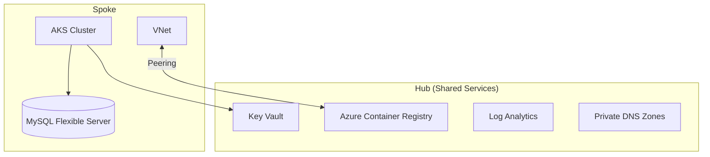

# 🏗️ Azure WordPress AKS - Infrastructure

Terraform for a Hub-Spoke Azure platform - AKS cluster, Container Registry,
Key Vault, and a managed MySQL database - built to host the WordPress app in
the companion [azure-wordpress-aks](https://github.com/chinmaymjog/azure-wordpress-aks)
repo, but generic enough for any containerized workload.

## System Docs

- Project specification: [docs/project-spec.md](docs/project-spec.md)
- Architecture decisions: [docs/architecture.md](docs/architecture.md)
- Execution tracker: [docs/tasks.md](docs/tasks.md)

---

## 🏗️ Architecture

A **Hub-Spoke** model: one shared Hub (ACR, Key Vault, Log Analytics,
management network) that a single Spoke (AKS cluster + MySQL database)
peers into.



Want multiple environments (dev/staging/prod) instead of one? Check out the
[`advanced` branch](https://github.com/chinmaymjog/azure-wordpress-aks-infra/tree/advanced)
- the same platform with dev/lab/preprod/prod Terraform workspaces and a
GitHub Actions CI/CD pipeline on top.

---

## 🛠️ Project Structure

```text
.
├── deploy.sh             # Deployment script - init, plan, apply, destroy
├── global.auto.tfvars    # Project name, region, K8s version
├── hub/                  # Shared hub: ACR, Key Vault, Log Analytics
├── aks/                  # AKS cluster
├── database/             # MySQL Flexible Server
├── modules/               # The actual Terraform resources for each of the above
└── .github/workflows/    # terraform fmt/validate on every push - no Azure
                            # credentials needed for this one
```

---

## 🚀 Quick Start

### 1. Prerequisites
- Terraform (v1.3+)
- Azure CLI
- A Service Principal with `Contributor` and `User Access Administrator`
  roles on your subscription:
  ```bash
  az ad sp create-for-rbac --name azure-wordpress-aks-infra --role Contributor --scopes /subscriptions/<subscription-id>
  az role assignment create --assignee <appId from above> --role "User Access Administrator" --scope /subscriptions/<subscription-id>
  ```

Node SSH access doesn't need a local key - `modules/aks` generates its own
keypair via Terraform's `tls` provider and stores the private half in Key
Vault, so `terraform plan`/`apply` work on a completely fresh clone with no
local file to create first.

### 2. Configure credentials
Create a `.env` file in the repo root (git-ignored) with the Service
Principal from step 1:
```bash
export ARM_CLIENT_ID="<appId>"
export ARM_CLIENT_SECRET="<password>"
export ARM_TENANT_ID="<tenant>"
export ARM_SUBSCRIPTION_ID="<subscription-id>"
```

### 3. Customize
Edit **`global.auto.tfvars`**: set `project` to a short unique string (used
in every resource name) and `hub_location` to your region.

### 4. Deploy
In order - Hub first, then Database and AKS (either order between those two):
```bash
./deploy.sh hub apply
./deploy.sh db apply
./deploy.sh aks apply
```
Each step calls `terraform plan` first when you omit `apply` (just run
`./deploy.sh hub`, `./deploy.sh db`, etc. to preview).

### 5. Verify
```bash
az aks get-credentials --resource-group rg-aks-<project>-main-weu --name aks-<project>-main-weu
kubectl get nodes
```

---

## 📈 Scaling Beyond a Single Environment

This branch is deliberately a single environment (`main.tfvars` for both
`aks/` and `database/`) with cost-optimized defaults (`Standard_B2ms`
nodes, `B_Standard_B1ms` database) - the fastest path to seeing it actually
work. Two ways to grow from here, both documented in more depth on the
[`advanced` branch](https://github.com/chinmaymjog/azure-wordpress-aks-infra/tree/advanced):

- **Bigger single environment**: edit `aks/aks-main-weu-terraform.tfvars`
  and `database/database-main-terraform.tfvars` directly - bump
  `node_vmsize`/`agent_count`/`dbsku` and re-run `./deploy.sh aks apply` /
  `./deploy.sh db apply`.
- **Multiple environments + CI/CD**: `advanced` keeps the
  dev/lab/preprod/prod split and a GitHub Actions pipeline authenticated
  via OIDC (no stored client secret) for automated `plan`/`apply`.

---

## 🚀 Next Steps: The Application Layer

Infrastructure is only the foundation. The application - container images,
Helm chart, and how to deploy it onto the cluster this repo provisions -
lives in the companion
[azure-wordpress-aks](https://github.com/chinmaymjog/azure-wordpress-aks) repo.

---

## 🛡️ License
Distributed under the MIT License. See `LICENSE` for more information.
