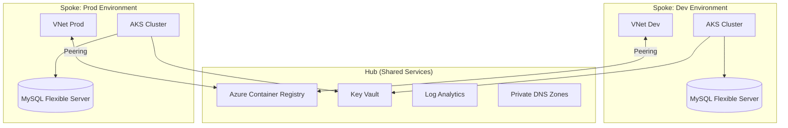

# 🏗️ Azure WordPress Stack: Tier 1 - Infrastructure

> **Part 1 of the Azure WordPress Stack ecosystem.**

This repository provides an enterprise-grade Infrastructure-as-Code (IaC) solution for deploying a secure, multi-environment Azure Kubernetes Service (AKS) infrastructure. It is the foundational layer for hosting WordPress.

## 🔗 Project Ecosystem Navigation

You are currently at **Step 1: Infrastructure**.

* **Next Step:** [Step 2: Base Docker Image (azure-wp-stack-docker-base)](https://github.com/chinmaymjog/azure-wp-stack-docker-base) - Build the optimized PHP/Nginx base image.
* **Full Ecosystem:**
  * 1️⃣ **Infrastructure** (You are here)
  * 2️⃣ [Base Docker Image](https://github.com/chinmaymjog/azure-wp-stack-docker-base)
  * 3️⃣ [Static Assets (Themes & Plugins)](https://github.com/chinmaymjog/azure-wp-stack-static-assets)
  * 4️⃣ [Helm Chart Deployment & App Boilerplate](https://github.com/chinmaymjog/azure-wp-stack-helm-chart)

---

## 🚀 Key Features

- **Hub-and-Spoke Architecture**: Centralized hub for shared resources (ACR, Key Vault, Log Analytics) with VNet peering to spoke environments.
- **Multi-Environment Ready**: Easily deploy isolated AKS clusters for Lab, Staging, and Production.
- **Automated Bootstrap**: A `deploy.sh` script automates the Terraform backend setup and execution order.
- **Pre-configured Add-ons**: The infrastructure deployed focuses cleanly on Azure resources. Ingress (NGINX), Cert-Manager, and Kured are designed to be deployed optionally as post-infrastructure steps.

---

## 🏗️ Architecture

This project implements a **Hub-and-Spoke** model in Azure to ensure centralized governance and isolated workloads.



- **Hub**: Central management for shared images (ACR), secrets (KV), and logs (LAW).
- **Spokes**: Independent environments (Lab, Dev, Prod) that consume Hub services via VNet Peering.

---

## 🛠️ Project Structure

```text
.
├── deploy.sh             # Main deployment automation engine
├── global_variables      # Global settings (project names, versions)
├── aks/                  # Spoke configuration for AKS clusters
├── hub/                  # Central hub infrastructure
├── modules/              # Reusable Terraform modules (AKS, Hub, Database)
└── .github/              # GitHub Actions for automated verification
```

---

## 🏁 Phase 1: Infrastructure Deployment (Terraform)

The `deploy.sh` script manages the lifecycle of your core platform: Hub services and Spoke environments.

### 1. Prerequisites
- **Terraform** (v1.3.x+)
- **Azure CLI** (v2.x)
- **Service Principal**: An SP with `Contributor` and `User Access Administrator` roles.

Node SSH access doesn't need a local key - `modules/aks` generates its own
keypair via Terraform's `tls` provider and stores the private half in Key
Vault, so `terraform plan`/`apply` work on a completely fresh clone with no
local file to create first.

### 2. Configure Credentials
Depending on your deployment method, you must provide Azure Service Principal credentials:

#### For Local Deployment (via `deploy.sh`)
Create a `.env` file in the root directory (git-ignored):
```bash
export ARM_CLIENT_ID="<your-app-id>"
export ARM_CLIENT_SECRET="<your-password>"
export ARM_TENANT_ID="<your-tenant-id>"
export ARM_SUBSCRIPTION_ID="<your-subscription-id>"
```

#### For GitHub Actions (Forked Repo)
CI authenticates via OIDC, not a stored secret - see [CI/CD & Deploying via GitHub Actions](#4-cicd--deploying-via-github-actions) below for the one-time Azure AD setup.

### 3. Project Configuration
Customize your foundation in **`global.auto.tfvars`**:
- **`project`**: A unique string for resource naming (e.g., `wp-stack`).
- **`hub_location`**: Your primary Azure region (e.g., `westeurope`).
- **⚠️ Scaling for Production**: By default, clusters use minimal tiers. To scale up, modify the environment-specific `.tfvars` files (e.g., `aks/aks-prod-weu-terraform.tfvars`) to use `Standard_D4ds_v5` nodes.

### 4. Deploy Infrastructure
The infrastructure **must** be deployed in this specific sequence:

1. **Hub**: Shared networking, ACR, and Key Vault.
   ```bash
   ./deploy.sh hub apply
   ```
2. **Database**: Managed MySQL for your environment.
   ```bash
   ./deploy.sh db apply dev weu
   ```
3. **AKS**: The Kubernetes cluster.
   ```bash
   ./deploy.sh aks apply dev weu
   ```

### 5. Verify Deployment
Once the AKS deployment finishes, verify access to your new cluster (assuming `project = "wp-stack"` and `env = "dev"`):
```bash
# 1. Get credentials for your cluster
az aks get-credentials --resource-group rg-wp-stack-dev-weu --name aks-wp-stack-dev-weu

# 2. Check node status
kubectl get nodes
```

---

## � Next Steps: The Application Layer

Infrastructure is only the foundation. The application - container images, Helm chart, and its own CI/CD - lives in the companion [azure-wordpress-aks](https://github.com/chinmaymjog/azure-wordpress-aks) repo, which deploys onto the cluster this repo provisions.

### 4. Scaling for Production Workloads
> [!NOTE]
> **Cost-Effective Testing Defaults:** To minimize Azure costs during initial testing and deployment validation, **all included environment templates** (including `prod` and `preprod`) have been purposely downscaled to use minimal compute tiers (e.g., `Standard_B2ms` nodes, `B_Standard_B1ms` databases, `Standard` storage).

If you are preparing to deploy this stack for a true production-grade environment, you **must** modify the environment-specific `.tfvars` files (like `aks/aks-prod-<region>-terraform.tfvars` and `database/database-prod-terraform.tfvars`) to ensure adequate scaling:

- **AKS Node Size & Count (`aks/`)**: Increase `node_vmsize` to at least `Standard_D4ds_v5` and scale the `agent_count` up to 3 or more for high availability. 
- **Additional Node Pools (`aks/`)**: Use the `node_pools` variable map to create dedicated VM pools if your workloads require specific isolation or powerful spot instances.
- **Database Sizing (`database/`)**: Increase the `dbsku` to a compute-optimized General Purpose tier (e.g., `GP_Standard_D4ds_v4`) rather than basic Burstable models (`B_Standard_B1ms`), and increase `dbsize` as needed.

- **AKS OS Disk Type & VM Cache (`aks/`)**: 
    - **Testing/Low-Cost**: If using small VM sizes (like `Standard_B2ms`), set `os_disk_type = "Managed"`. These VM tiers often lack the sufficient cache required for Ephemeral disks.
    - **Production**: For high performance and faster node scaling, it is recommended to use `os_disk_type = "Ephemeral"`. This requires selecting a VM size with a cache large enough to accommodate your `os_disk_size_gb` (e.g., `Standard_D4ds_v5` or larger).

### 4. CI/CD & Deploying via GitHub Actions
This repository includes workflows in `.github/workflows/` (`deploy.yml` and `verify.yml`). `verify.yml` runs `terraform fmt`/`validate` on every push/PR across all three components (hub, aks, database) with no Azure credentials needed. `deploy.yml` authenticates via **OpenID Connect (OIDC)** - no client secret is stored in GitHub at all.

If you wish to host your own version of this infrastructure:
1. **Fork the Repository**: Fork this repository to your own GitHub account.
2. **Create an Azure AD App Registration with a federated credential** trusting this specific repo/branch, instead of a client secret:
   ```bash
   az ad app create --display-name "azure-wordpress-aks-infra-cicd"
   # note the appId from the output, then:
   az ad sp create --id <appId>
   az role assignment create --assignee <appId> --role Contributor --scope /subscriptions/<subscription-id>
   az role assignment create --assignee <appId> --role "User Access Administrator" --scope /subscriptions/<subscription-id>
   az ad app federated-credential create --id <appId> --parameters '{
     "name": "github-advanced-branch",
     "issuer": "https://token.actions.githubusercontent.com",
     "subject": "repo:<your-github-username>/azure-wordpress-aks-infra:ref:refs/heads/advanced",
     "audiences": ["api://AzureADTokenExchange"]
   }'
   ```
   Repeat the `federated-credential create` step with `"subject": "repo:.../azure-wordpress-aks-infra:environment:production"` if you also want `workflow_dispatch` applies (gated behind the `production` GitHub Environment) to authenticate.
3. **Set GitHub Secrets**: In your forked repository, go to Settings > Secrets and variables > Actions. Add:
    - `ARM_CLIENT_ID` (the app registration's `appId`)
    - `ARM_TENANT_ID`
    - `ARM_SUBSCRIPTION_ID`

    No `ARM_CLIENT_SECRET` - OIDC doesn't need one.
4. **Deploy**:
    - Pushes to `main` automatically trigger `verify.yml`.
    - To actually deploy, run the `deploy.yml` workflow manually from the **Actions** tab, choosing the component, environment, and `plan`/`apply`.

---

## 🛡️ License
Distributed under the MIT License. See `LICENSE` for more information.
